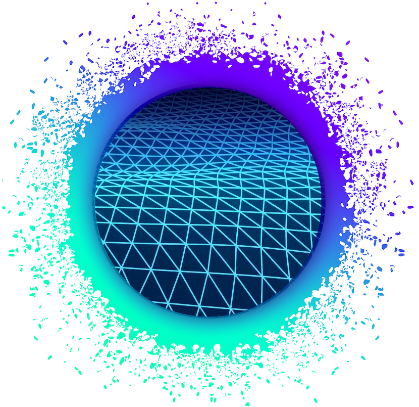

# Holoscape

[](http://holochain.org/)
[](https://chat.holochain.org)

[](https://twitter.com/holochain)

A complete end-user deployment of a Holochain conductor with UI for administration and a run-time for hApp UIs.



## Setup for development
```
npm install
```
Copy an `holochain` binary into the holoscape directory as `holochain-linux` or `holochain-darwin`, depending on your OS, e.g.:

``` shell
$ nix-shell https://holochain.love
$ cp `which holochain` holochain-linux
```

``` shell
npm install
```

## Run for development
```
npm start
```


## Contribute
Holochain is an open source project.  We welcome all sorts of participation and are actively working on increasing surface area to accept it.  Please see our [contributing guidelines](/CONTRIBUTING.md) for our general practices and protocols on participating in the community, as well as specific expectations around things like code formatting, testing practices, continuous integration, etc.

## License
[](http://www.gnu.org/licenses/gpl-3.0)

Copyright (C) 2019, Holochain Foundation

This program is free software: you can redistribute it and/or modify it under the terms of the license p
rovided in the LICENSE file (GPLv3).  This program is distributed in the hope that it will be useful, bu
t WITHOUT ANY WARRANTY; without even the implied warranty of MERCHANTABILITY or FITNESS FOR A PARTICULAR
 PURPOSE.

**Note:** We are considering other 'looser' licensing options (like MIT license) but at this stage are using GPL while we're getting the matter sorted out.  See [this article](https://medium.com/holochain/licensing-needs-for-truly-p2p-software-a3e0fa42be6c) for some of our thinking on licensing for distributed application frameworks.
